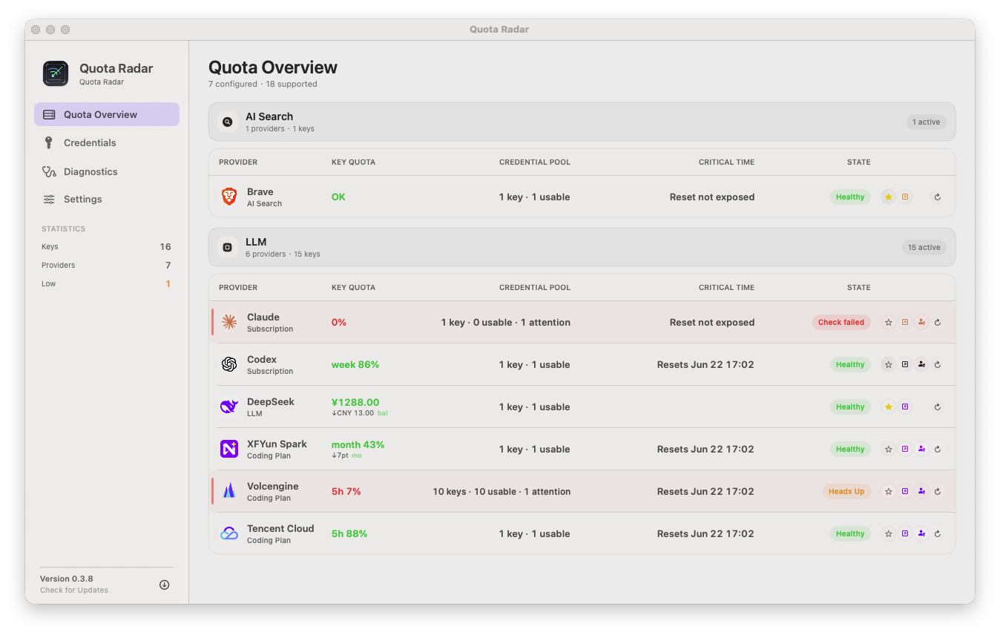
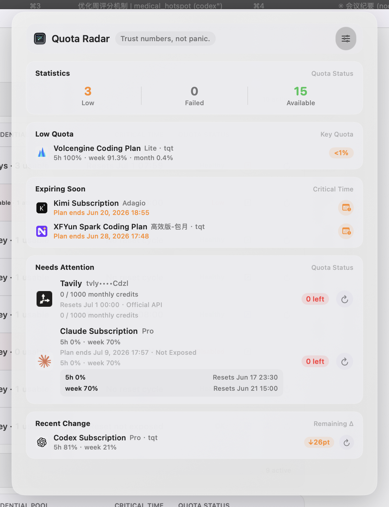

# Quota Radar

<p align="right">
  Language:
  <strong>English</strong> |
  <a href="./README.zh-Hans.md">简体中文</a>
</p>

Quota Radar is a macOS menu bar app for monitoring search API balances and LLM coding-plan quotas. It is designed like a compact monitoring utility: the menu bar shows the smallest actionable signal, the popover triages risk, and the main window explains key quota, recent change, timing, refresh status, and actions.


Current version: `v0.4.2`.

## Screenshots

<p align="center">
  
</p>

<p align="center">
  <em>The main window shows provider-level Key Quota, Credential Pool, Critical Time, Status, and actions. Recent change stays under Key Quota; expanded accounts keep plan, quota windows, critical time, and refresh status separated. Screenshots are captured from the running app, with credentials masked by Quota Radar.</em>
</p>

<p align="center">
  
</p>

<p align="center">
  <em>The menu bar popover is a compact attention feed: a one-line risk summary, a short watchlist, and a risk-ranked list of the few quota signals that need action.</em>
</p>

## Features

- Risk-first menu bar popover for low quota, expiring plans, failed checks, and recent activity, with row clicks jumping to the matching provider and account in the main window.
- Main quota overview organized by `Provider`, `Key Quota`, `Credential Pool`, `Critical Time`, `Status`, and actions.
- Multiple accounts per provider, with account-level plan, remaining quota, reset/expiry timing, and update time.
- Recent quota changes stay beside the quota they describe; `Last Updated` stays a refresh-status signal instead of repeating consumption deltas.
- API-key and web-login authorization credentials, including companion API keys for providers whose quota checks require web login.
- Local secret storage in `~/Library/Application Support/QuotaRadar/secrets.json` with `0600` permissions.
- `.env`, cURL, and `~/.claude/settings.json` import paths for supported providers.
- Configurable automatic refresh, quota-consuming refresh protection, proxy settings, color scheme, launch at login, and GitHub Release update checks in standard builds.
- White-label / no-updater build mode for distribution packages that should not embed the upstream GitHub Release URL.

## Quick Start

```bash
./install.sh --bundle-only --rebuild
open 'build/Quota Radar.app'
```

Install into `/Applications`:

```bash
./install.sh
```

Run behavior tests:

```bash
bash Tests/run_behavior_tests.sh
```

For the full setup flow, see [Quickstart](./docs/quickstart.md).

## Cross-Platform Tauri Track

The Tauri app in `apps/desktop-tauri` is a cross-platform migration track, not the stable release track and not a drop-in replacement for the Swift macOS app yet. It must first catch up with the current Swift mainline features, quota-history semantics, provider calibration rules, and the native compact monitoring style before it can be treated as a preview candidate.

Useful checks while working on that track:

```bash
bash scripts/check_tauri_sources.sh
cd apps/desktop-tauri
pnpm install
pnpm test -- --run
pnpm typecheck
cargo test --manifest-path src-tauri/Cargo.toml
pnpm tauri build --no-bundle --ci
```

The current Tauri gap list is tracked in [Desktop Tauri Parity Checklist](./docs/desktop-tauri-parity-checklist.md).

## White-Label Build

Use this mode when you need a DMG without automatic update checks and without embedded upstream GitHub Release URLs:

```bash
scripts/package_dmg.sh --rebuild --white-label
open build/QuotaRadar-WhiteLabel.dmg
```

The white-label flag is compile-time, not a runtime preference. It hides update-check UI, disables launch-time update checks, and removes the hardcoded GitHub Release endpoints from the app bundle.

## Supported Providers

AI Search providers include Tavily, Brave Search, SerpAPI, Serper, Exa, Bocha, AnySearch, Querit, and WeChat Search.

LLM / plan providers include Claude Subscription, Anthropic Credits, Codex Subscription, Kimi, LongCat, DeepSeek, XFYun Spark Coding Plan, Volcengine Coding Plan, OpenCode Go, Aliyun Coding Plan, and Tencent Cloud Coding Plan.

Provider credential types, quota fields, reset windows, plan expiry, parser notes, and hidden extension stubs are documented in [Providers](./docs/providers.md).

## Documentation

- [Quickstart](./docs/quickstart.md)
- [Providers](./docs/providers.md)
- [Provider Calibration](./docs/provider-calibration.md)
- [Release QA](./docs/release-qa.md)
- [Roadmap](./docs/roadmap.md)
- [Desktop Tauri Parity Checklist](./docs/desktop-tauri-parity-checklist.md)
- [中文 README](./README.zh-Hans.md)

## Unsigned DMG And Gatekeeper

Local, self-use, or no-fee unsigned DMG:

```bash
scripts/package_dmg.sh --rebuild
open build/QuotaRadar.dmg
```

Manual GitHub Release upload:

```bash
gh release create v0.4.2 build/QuotaRadar.dmg \
  --title "Quota Radar v0.4.2" \
  --notes "Fixes Kimi quota-window duplicate details, keeps update-check status visible after successful no-update checks, and includes the latest subscription/reset metadata refinements."
```

Unsigned DMGs do not require an Apple Developer Program account, but macOS Gatekeeper may block downloaded copies. Install only if you trust the source repository and release. If macOS says the app is damaged or cannot be opened:

```bash
xattr -dr com.apple.quarantine '/Applications/Quota Radar.app'
open '/Applications/Quota Radar.app'
```

For broader distribution, use Developer ID signing and Apple notarization.
