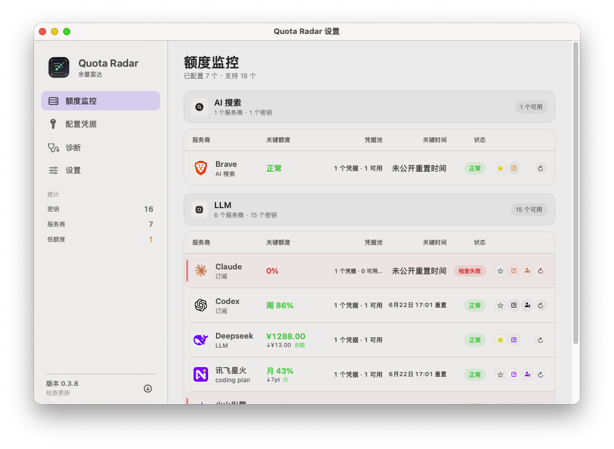
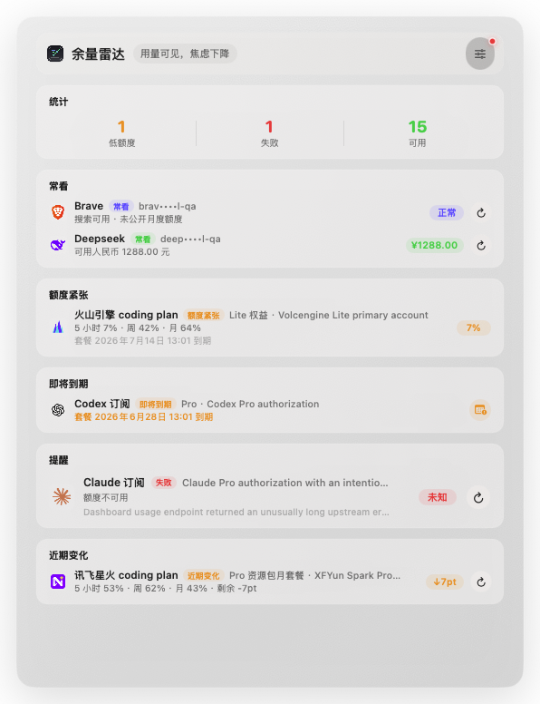

# Quota Radar

<p align="right">
  语言：
  <strong>简体中文</strong> |
  <a href="./README.md">English</a>
</p>

Quota Radar 是一个 macOS 状态栏应用，用来监控搜索 API 余额和 LLM coding plan 额度。它按紧凑监控工具的思路设计：状态栏只展示最小的可行动信号，弹窗优先提示风险，主窗口解释当前额度、近期动态、关键时间、状态和操作。


当前版本：`v0.3.8`。

## 界面预览

<p align="center">
  
</p>

<p align="center">
  <em>主窗口展示 provider 当前额度、近期动态、关键时间、状态和操作；展开后按账号压缩为套餐、剩余额度、重置/到期和更新时间。截图来自真实运行画面，密钥由应用自动打码。</em>
</p>

<p align="center">
  
</p>

<p align="center">
  <em>状态栏弹窗保留最重要的额度信号，不把菜单做成完整仪表盘。</em>
</p>

## 功能

- 风险优先的状态栏弹窗：低额度、即将到期、刷新失败和近期消耗会优先出现。
- 主窗口按 `Provider`、`Current`、`Activity`、`Time`、`Status` 和操作组织额度概览。
- 每个 provider 支持多个账号；账号行展示套餐名、剩余额度、重置/到期时间和更新时间。
- 支持 API Key 与网页登录授权；部分订阅类 provider 可额外保存可复制 API Key。
- 凭据本地存储在 `~/Library/Application Support/QuotaRadar/secrets.json`，权限为 `0600`。
- 支持 `.env`、cURL 和 `~/.claude/settings.json` 导入。
- 支持自动刷新、消耗额度刷新保护、网络代理、配色模式、开机启动和 GitHub Release 更新检查。

## 快速开始

```bash
./install.sh --bundle-only --rebuild
open 'build/Quota Radar.app'
```

安装到 `/Applications`：

```bash
./install.sh
```

运行行为测试：

```bash
bash Tests/run_behavior_tests.sh
```

完整配置流程见 [快速启动](./docs/quickstart.zh-Hans.md)。

## 支持的服务商

AI Search provider 包括 Tavily、Brave Search、SerpAPI、Serper、Exa、Bocha、AnySearch、Querit 和微信搜索。

LLM / plan provider 包括 Claude Subscription、Codex Subscription、Kimi、DeepSeek、讯飞星火 Coding Plan、火山引擎 Coding Plan、OpenCode Go、阿里云 Coding Plan 和腾讯云 Coding Plan。

| Provider | 用途 |
| --- | --- |
| Claude | 订阅网页登录授权额度监控；可额外保存 API Key 方便复制 |
| Codex | ChatGPT/Codex 订阅窗口额度监控；可额外保存 API Key 方便复制 |
| Kimi | Kimi Code 额度与会员余额监控 |
| DeepSeek | API Key 人民币余额监控 |

各 provider 的凭据类型、额度字段、重置窗口、套餐到期、parser 备注和隐藏扩展桩见 [Providers](./docs/providers.zh-Hans.md)。

## 文档

- [快速启动](./docs/quickstart.zh-Hans.md)
- [Providers](./docs/providers.zh-Hans.md)
- [Roadmap](./docs/roadmap.zh-Hans.md)
- [English README](./README.md)

## 未签名 DMG 与 Gatekeeper

本机自用或不付费发布的未签名 DMG：

```bash
scripts/package_dmg.sh --rebuild
open build/QuotaRadar.dmg
```

手动发布到 GitHub Release：

```bash
gh release create v0.3.8 build/QuotaRadar.dmg \
  --title "Quota Radar v0.3.8" \
  --notes "Unsigned DMG for trusted users. macOS may require removing quarantine on first launch."
```

未签名 DMG 不需要 Apple Developer Program，但 macOS Gatekeeper 可能拦截下载后的 app。只在信任源码和 release 的情况下安装。如果 macOS 提示 app 已损坏或无法打开：

```bash
xattr -dr com.apple.quarantine '/Applications/Quota Radar.app'
open '/Applications/Quota Radar.app'
```

面向更广泛用户分发时，仍建议使用 Developer ID 签名并完成 Apple notarization。
